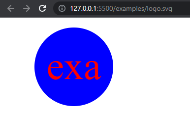

# SVG Logo Maker

## Description

The purpose of this application is to take in user input generate a logo and save it as an SVG file. The application will ask the user four questions and make a logo from those questions. The user can also test for the render() method for each shape. There is a walkthrough video in this readme for extra help.

## Installation

Only installation needed are the Inquirer package and the Jest package. Just follow this URL to get to walkthrough.
URL: https://drive.google.com/file/d/1wey6i49zuEsvCT3XPQAvw0qryumoCofR/view

## Usage

The user will just need to run "node index" to start the application. The user will be asked four questions. It will ask for three text characters, color of characters, type of shape, and the color of the shape. After the user types those inputs the application will console log that the logo was generated. The user will find the new logo.svg file in the examples folder.

## Image

